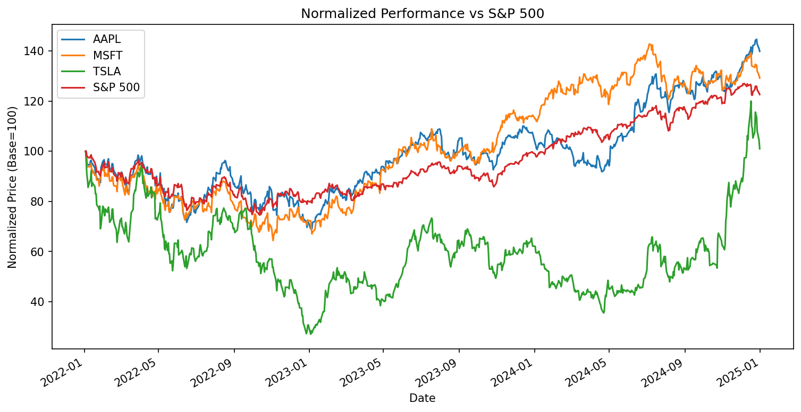

# Stock Analysis Project

A Python-based stock market analysis notebook that uses historical data to compare the performance of **Apple (AAPL)**, **Microsoft (MSFT)**, and **Tesla (TSLA)** between **2022-01-01** and **2025-01-01**, benchmarked against the **S&P 500**.

The project downloads stock data using `yfinance`, performs financial analysis, and visualizes price trends, daily returns, volatility, correlations, risk-adjusted performance, and relative performance against the broader market.

---

## Features

- Download historical stock data from Yahoo Finance
- Analyze closing prices of multiple stocks
- Plot individual stock price trends
- Compare stock prices on one chart
- Calculate daily returns
- Measure volatility
- Compute annualized volatility
- Generate correlation matrix between stocks
- Visualize correlations using a heatmap
- Calculate total return for each stock
- Calculate Sharpe ratio (risk-adjusted return) for each stock
- Compare each stock's normalized performance against the S&P 500 benchmark
- Summarize key metrics in a table

---

## Stocks Analyzed

- **AAPL** — Apple Inc.
- **MSFT** — Microsoft Corporation
- **TSLA** — Tesla, Inc.
- **S&P 500 (^GSPC)** — Market benchmark

---

## Project Workflow

1. Import required libraries
2. Download stock data using `yfinance`
3. Extract closing prices
4. Visualize stock price trends
5. Compute daily percentage returns
6. Calculate volatility and annualized volatility
7. Build a correlation matrix
8. Plot correlation heatmap
9. Calculate total return
10. Calculate Sharpe ratio for each stock
11. Download S&P 500 benchmark data
12. Normalize and compare stock performance against the benchmark
13. Create a summary table

---

## Technologies Used

- Python
- Pandas
- Matplotlib
- Seaborn
- yFinance

---

## Installation

Install the required libraries before running the notebook:

```bash
pip install yfinance pandas matplotlib seaborn
```

---

## Usage

1. Clone this repository:

```bash
git clone https://github.com/alijalayian/Stock-Market-Analysis-with-Python.git
cd Stock-Market-Analysis-with-Python
```

2. Open the Jupyter Notebook:

```bash
jupyter notebook
```

3. Run the notebook step by step.

---

## Example Analysis

### Closing Price Trends
The notebook plots the price movement of AAPL, MSFT, and TSLA over the selected time period.


### Daily Returns
Daily percentage change is used to observe short-term stock movement.

### Volatility
The project calculates both:
- **Daily volatility**
- **Annualized volatility**

### Correlation Matrix
A heatmap is generated to show how strongly the stocks move together.


### Total Return
The total return for each stock is calculated as:

```
Total Return (%) = ((Final Price / Initial Price) - 1) × 100
```

### Sharpe Ratio
The Sharpe ratio measures risk-adjusted return — how much return a stock generates per unit of risk taken, after subtracting a risk-free baseline (approximated here using a 4% annual risk-free rate). A higher Sharpe ratio means better reward relative to the risk involved, rather than simply the highest raw return.

```
Sharpe Ratio = (Annual Return - Risk-Free Rate) / Annual Volatility
```

### Benchmark Comparison (vs. S&P 500)
Raw prices across AAPL, MSFT, TSLA, and the S&P 500 are not directly comparable since each starts from a different price level. The notebook normalizes all series to a common starting value of 100, allowing a direct visual comparison of relative growth over the period — revealing which stocks outperformed or underperformed the broader market.



---

## Output Summary

The final output includes:
- Closing price charts
- Daily return statistics
- Volatility values
- Correlation matrix
- Heatmap visualization
- Total return summary table
- Sharpe ratio for each stock
- Normalized performance comparison against the S&P 500 benchmark

---

## File Structure

```bash
project-1-stock-analysis.ipynb
README.md
images/
    price_comparison.png
    correlation_heatmap.png
    benchmark_comparison.png
```

---

## Possible Improvements

You can extend this project by adding:

- Moving averages
- Candlestick charts
- Portfolio simulation
- More stocks and sectors
- Interactive dashboard using Plotly or Streamlit

---

## Author

**Ali Jalayian**
[GitHub](https://github.com/alijalayian)

---

## License

This project is for educational purposes.
